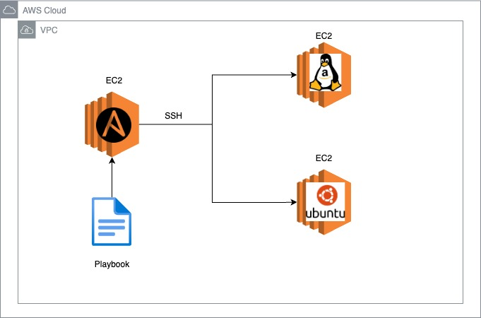

# Getting Started with Create React App

This project was bootstrapped with [Create React App](https://github.com/facebook/create-react-app).

## Available Scripts

In the project directory, you can run:

### `npm start`

Runs the app in the development mode.\
Open [http://localhost:3000](http://localhost:3000) to view it in the browser.

The page will reload if you make edits.\
You will also see any lint errors in the console.

### `npm test`

Launches the test runner in the interactive watch mode.\
See the section about [running tests](https://facebook.github.io/create-react-app/docs/running-tests) for more information.

### `npm run build`

Builds the app for production to the `build` folder.\
It correctly bundles React in production mode and optimizes the build for the best performance.

The build is minified and the filenames include the hashes.\
Your app is ready to be deployed!

See the section about [deployment](https://facebook.github.io/create-react-app/docs/deployment) for more information.

## Docker file

Dockerfile uses multistage to reduce image weight. 
Node as base image
Ngnix as server
file default.conf -> redirects requests to index.html
Default container port: 80
Dockefile reference : CMD
To create multi OS images requires docker [buildx](https://docs.docker.com/reference/cli/docker/buildx/) to push images

## Ansible
Ansible playbook can be executed on ubuntu and linux servers as root user.
Aansible master is run on a linux server
Ansible version 2.15.3

To run playbook use `ansible-playbook ansible_multi_os.yaml` 
    Note:Ansible Nodes must be already synced up with master

## Peex_script

This script is mean to be use as user data file when launching a Linux ec2 instance.
what it does:
- Update packages to the latest version
- Create a new user: script-user
- Assing a password for script-user
- Install httpd (Apache), enable and start the service
- Open Ports 8080 and 8090
- Create a basic index.html with a header, a title saying 'Welcome New User' and adds a GIF item (PATH: /var/www/html/index.html)
- Download a static webpage from an S3 bucket on AWS with wget (PATH: /var/www/a3/)
- Create a VirtualHost configuration file to serve satatic content on port 8090
- file `user_data_script_64` is encrypted with base64 encoding

## Learn More

You can learn more in the [Create React App documentation](https://facebook.github.io/create-react-app/docs/getting-started).

To learn React, check out the [React documentation](https://reactjs.org/).
About [VirtualHost](https://httpd.apache.org/docs/2.4/vhosts/)

